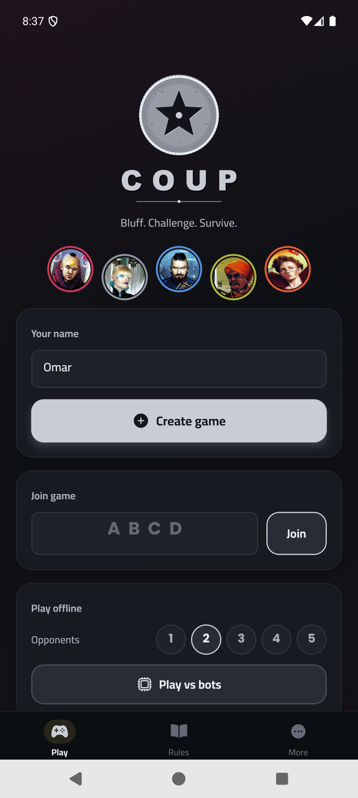
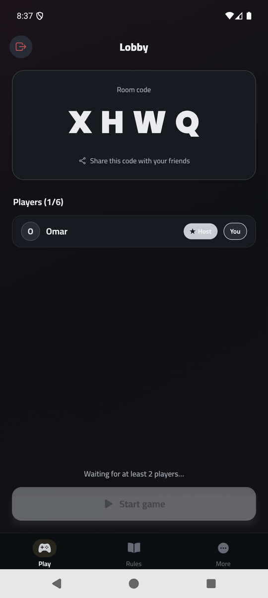
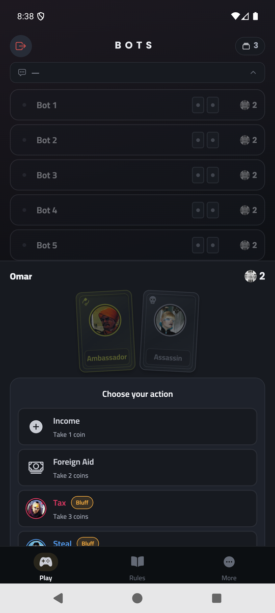
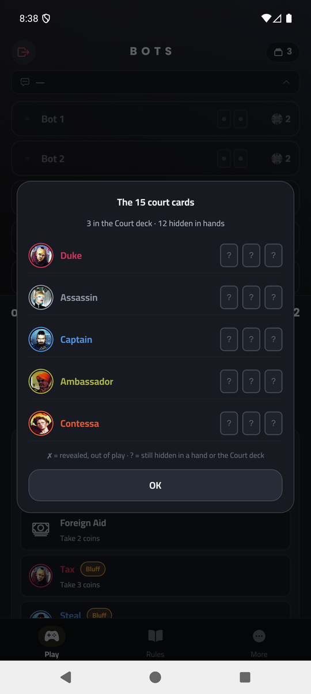
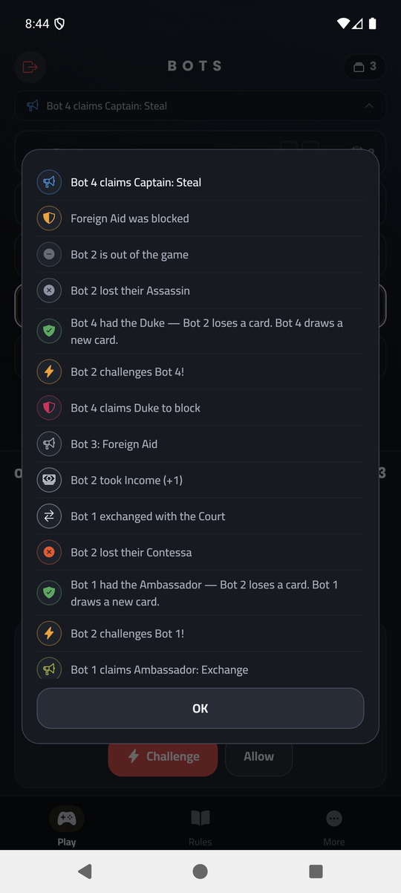
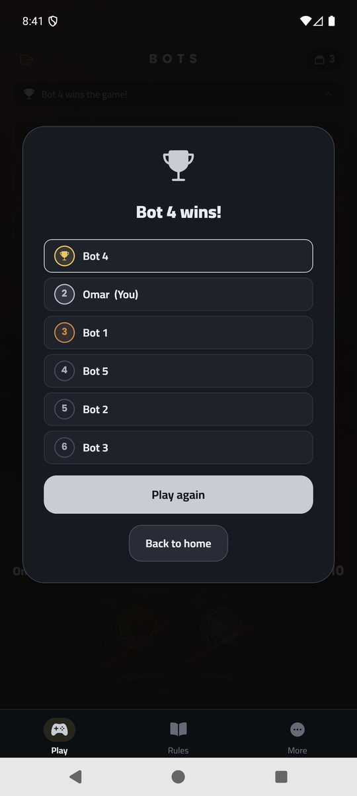
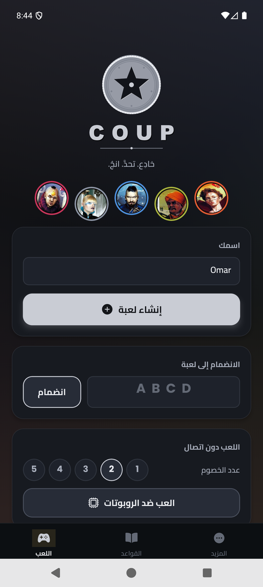
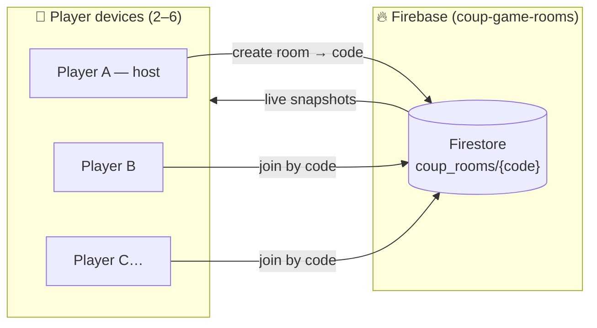

# Coup — كوب

A React Native mobile adaptation of the bluffing card game **Coup** for
playing with friends — each player installs the app on their own device
and everyone joins the same room with a 4-letter code. 2–6 players.

Arabic + English, dystopian dark & gold theme, vector character art.

## Screenshots

| Home | Lobby | Game table | Deck tracker |
|:---:|:---:|:---:|:---:|
|  |  |  |  |

| Game history | Final standings | العربية |
|:---:|:---:|:---:|
|  |  |  |

## How multiplayer works



No backend server. The full `GameState` lives in a single Firestore doc
as JSON; every move runs the **pure rules engine** locally and commits
the resulting state in a transaction (optimistic concurrency — stale
moves validate against the fresh state and no-op). Hidden cards are
hidden by the UI, not the wire — fine for friendly games.

Storage is self-cleaning: the last player to leave a game deletes the
room doc, and every room creation sweeps rooms older than 24 hours —
no server-side garbage collector needed.

**Offline mode**: play against 1–5 bots with no connection at all — the
same engine runs in-memory and a shared bot policy (`src/ai.ts`) plays
every action, block, challenge and bluff.

## The rules engine

**Full game specification lives in [GAME.md](GAME.md)** — rules,
characters, state machine, edge-case semantics, and the multiplayer
protocol, complete enough to reconstruct the game from scratch.

`src/engine/` is a dependency-free TypeScript reducer implementing the
complete rule set:

- Income / Foreign Aid / **Coup** (mandatory at 10+ coins, unstoppable)
- **Duke** Tax · **Assassin** Assassinate · **Captain** Steal ·
  **Ambassador** Exchange · **Contessa** blocks assassination
- Challenges on any claim (actions *and* blocks) with the
  reshuffle-and-replace rule for proven claims
- Correct coin semantics: a successfully *challenged* action refunds its
  cost; a successfully *blocked* one does not (the assassin's fee burns)
- Steal takes `min(2, target coins)`; the target-challenges-a-real-assassin
  double-loss is handled; forfeits keep windows consistent

`npm test` runs 100+ assertions covering every branch.
`scripts/integration.test.ts` replays a full game through the Firestore
emulator under the production security rules.

## Stack

- **Expo 57 / React Native 0.86** (Fabric), Expo Router, TypeScript strict
- **Reanimated 4** — press feedback (`Pressy`), card reveals, panel
  transitions; deliberately subtle
- **react-native-pager-view** — Play / Rules / More tabs all mounted at
  once, nothing re-mounts on tab change
- **firebase (web SDK)** — Firestore only, no native Firebase modules
- **react-native-svg** — role emblems and coin art, crisp at any size
- Cairo (Arabic) + Poppins (Latin) fonts; manual RTL (`I18nManager`
  pinned to LTR, `row-reverse`/`textAlign` per component)

## Development

```bash
npm install
npx expo run:android          # or run:ios

# engine tests
npm test

# local end-to-end against the Firestore emulator
firebase emulators:start   # uses firebase.json + .firebaserc (coup-game-rooms)
EXPO_PUBLIC_FIRESTORE_EMULATOR=10.0.2.2:8080 npx expo run:android
FIRESTORE_EMULATOR=localhost:8080 npx tsx scripts/integration.test.ts
FIRESTORE_EMULATOR=localhost:8080 npx tsx scripts/bot.ts auto CODE Bot1
```

`scripts/bot.ts` is a headless player (join / auto-play / scripted
one-shot moves) used for multiplayer testing.

## Releases

```bash
./scripts/release.sh
```

Produces in `release-out/`:

- `Coup-vX.Y.Z-arm64.apk` — slim arm64-v8a APK (recommended)
- `Coup-vX.Y.Z-universal.apk` — all ABIs (older devices, emulators)
- `Coup-vX.Y.Z.ipa` — unsigned iOS device build for sideloading

## Firestore rules

The game has its **own Firebase project** (`coup-game-rooms`) — fully
separate from the Lawazem apps. Rules live in this repo's
`firestore.rules` (public read/write with structure + size validation,
6-player cap) and deploy with:

```bash
firebase deploy --only firestore:rules
```

## License

Private. Coup game design by Rikki Tahta / Indie Boards & Cards — this
is an unofficial fan adaptation for personal use.
